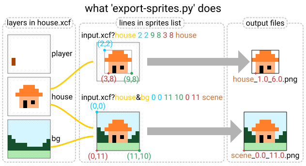

# 15-466 Sprite Pipeline

Sprites are pixel rectangles. Our sprite pipeline deals with them by packing them into atlas textures. The pipeline works in two steps: first, sprites are **extracted** from source images, then they are **merged** into atlases.

## Extraction

Sprite extraction is done by `extract-sprites.py`:

```
python3 extract-sprites.py <sprites.list> <out_directory> [--gimp=path/to/gimp]
```

Where `sprites.list` has lines in the following format:
```
"image-to-load.xcf?layer 1&layer 2&layer 3" minX minY maxX maxY anchorX anchorY "output name"
```

The script uses GIMP to crop the image to the [minX,maxX]x[minY,maxY] rectangle (in pixels, with the origin in the upper left), and writes an output file `out_directory/output name_ax_ay.png` where ax and ay are anchor values (in pixels, with the origin in the upper left).



If layer names are given, only these layers will be shown. If no layer names are given, layer visibility will remain whatever the default is in the file.
